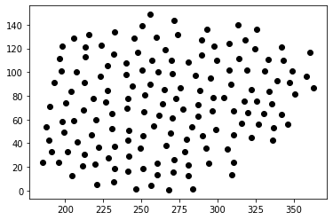

# Fast Poisson Disk Sampling in Arbitrary Dimensions
Implementation of [Fast Poisson Disk Sampling in Arbitrary Dimensions](https://www.cs.ubc.ca/~rbridson/docs/bridson-siggraph07-poissondisk.pdf) 
by Robert Bridson, University of British Columbia. The provided source code implements the algorithm in 2D and 3D. Extensions into input spaces 
of higher dimensions require slight modification of the algorithm.

## Example Distribution

